<picture>
    <source media="(prefers-color-scheme: dark)" srcset="images/microchip_logo_white_red.png">
    <source media="(prefers-color-scheme: light)" srcset="images/microchip_logo_black_red.png">
    
</picture>

# dsPIC33A Dual Partition Demo

---

**NOTE: THIS DEMO IS AN ENGINEERING RELEASE TO DEMONSTRATE dsPIC33A DUAL PARTITION FUNCTIONALITY AND SHOULD BE USED FOR REFERENCE ONLY. THIS CODE IS NOT INTENDED FOR USE IN PRODUCTION.**

---

 
_Figure 1. - dsPIC33A Curiosity Platform Development Board_  

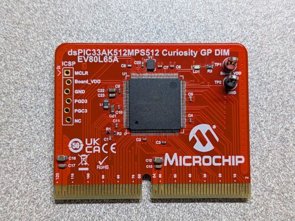 
_Figure 2. - dsPIC33AK512MPS512 Curiosity GP DIM_  

## Introduction
The associated partition1 and partition2 projects demonstrate the following:
* Programming the dsPIC33AK512MPS512 in Dual Partition Mode
* Switching between partition 1 and partition 2
* Performing a partition erase 
* Configuring flash protection regions in Dual Partition mode

## Related Documentation 
* [dsPIC33A Curiosity Platform Development Board (EV74H48A)](https://www.microchip.com/en-us/development-tool/ev74h48a)
* [dsPIC33AK512MPS512 DIM (EV80L65A)](https://www.microchip.com/en-us/development-tool/ev80l65a)

## Tools 

### Software 
* The unzipped example project files, partition1.X and partition2.X
* [MPLAB® X IDE v6.25 or later](https://www.microchip.com/en-us/tools-resources/develop/mplab-x-ide)
* [MPLAB® XC-DSC v3.21 or later](https://www.microchip.com/en-us/tools-resources/develop/mplab-xc-compilers/xc-dsc)
* A terminal emulation program that supports UART such as [Tera Term](https://teratermproject.github.io/index-en.html)

### Hardware
* [dsPIC33AK512MPS512 DIM (EV80L65A)](https://www.microchip.com/en-us/development-tool/ev80l65a)
* [dsPIC33A Curiosity Platform Development Board (EV74H48A)](https://www.microchip.com/en-us/development-tool/ev74h48a)
* A USB-Type C cable (for powering the board)

## Running the Demo

1. Insert the dsPIC33AK512MPS512 Curiosity GP Dim into the dsPIC33A Curiosity DIM Connector.
2. Connect the USB-C cable to connector J24 of the Development Board to the host computer.
3. Launch a Tera Term terminal (or similar), selecting the serial port used by the Development Board.
4. Configure the serial port to run at 460800 baud.
5. Open the partition1.X project in MPLAB® X. Within the Open Project window, check the "Open Required Projects" checkbox. This will automatically open partition2.X. 
    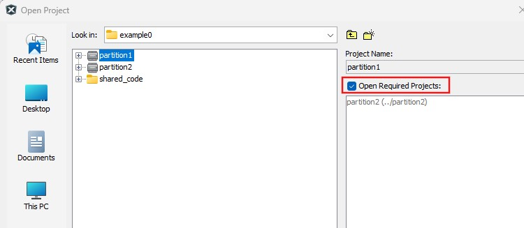 
    _Figure 3. - Open Required Projects_ 
    **Note**: The Partition number has been set for partition1.X and partition2.X under Project Properties &rarr; XC-DSC &rarr; XC-DSC (Global Options) &rarr; Partition 
    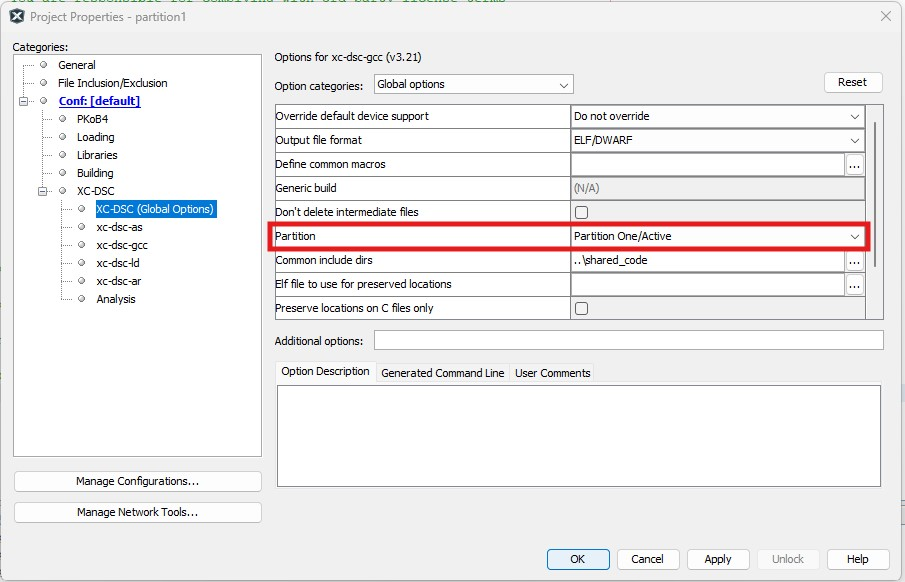 
    _Figure 4. - Project Properties Partition Select_ 
6. Set partition1.X as the main project in MPLAB X. 
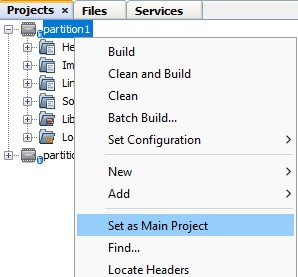 
_Figure 5. - Partition1 Set as Main Project_ 
7. Press the "Make and Program" button on the top bar to program parition1.X, selecting the appropriate programmer if prompted. 
    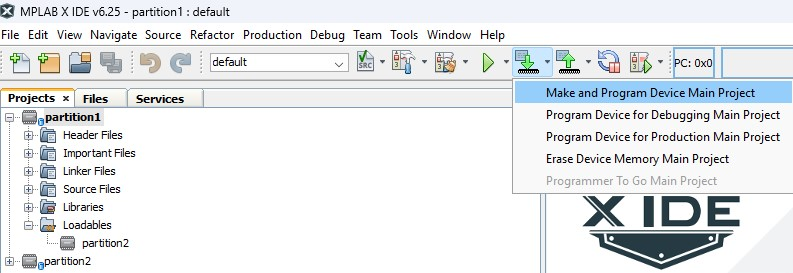 
    _Figure 6. - "Make and Program" button in MPLAB X_ 
8. The board should now be programmed, as indicated by LED0 blinking, and the terminal window opened in Step 3 should now display the dual partition demo menu. 
    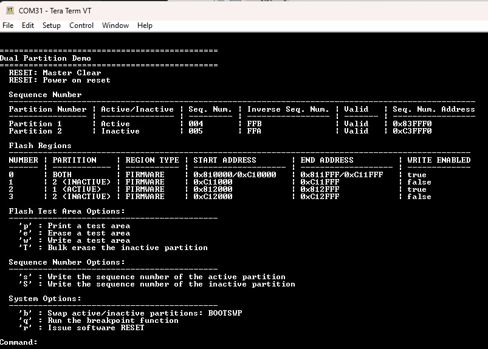 
    _Figure 7. - Dual Partition Demo Menu_ 
    
Once the demo code is running on board there are a series of labs (lab0 - lab5) to walk through various dual boot use cases using this demo code including:
 * Dual boot project creation
 * Sequence numbers 
 * Flash protection regions
 * BOOTSWP instructions 
 * Debugging 
 * Congifuration bits

All commands implemented in this demo that are used for these labs are documented below in the [Demo Usage](#demo-usage) section.

## Demo Usage

Upon programming partition1.X, the terminal window will display a list of reset sources, the Active and Inactive Partitions along with their associated sequence numbers, the flash regions and their associated settings, a menu with various partition operations, and a command input. 

 
_Figure 11. - Dual Partition Demo Menu_ 

### Flash Test Area Options

Three commands are listed under the "Flash Test Area Options" header: 'p', 'e', 'w', and 'T'. 

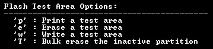 
_Figure 12. - Flash Test Area Options_ 

The `p` command prints the current contents of a selected flash test area. It presents a menu with 6 selections covering the test areas in both the active and inactive partitions.

The `e` command erases a 4KB test area. It also presents a menu with 6 selections covering the flash test areas in both the active and inactive partitions. After the erase completes, the region is printed so the updated contents can be reviewed.

The `w` command writes 256 bytes to a selected test area and then prints the region after the write completes.

The `T` command performs a bulk erase of the inactive partition.

Note that erase, write, and bulk erase operations may fail depending on the write permissions configured for the selected region. A success or failure message is displayed after each operation completes.

See [Flash Protection Regions](#flash-protection-regions) for details on the flash protection region configurations. 

### Sequence Number Options

Two commands are listed under the "Sequence Number Options" header: 's', and 'S'. 

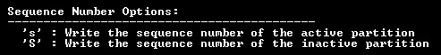 
_Figure 13. - Sequence Number Options_ 

The `S` command writes a new sequence number to the inactive partition while the lower case `s` command writes a new sequence number to the inactive partition. 

When either command is entered, the demo prompts for a 24-bit sequence number in the format `IBTSEQn + BTSEQn`. See [Boot Sequence Number](#boot-sequence-number) for details. After the value is entered, the menu is reprinted with the updated sequence number.

**Note:** If an invalid value is entered, the sequence number menu will display `INVALID`; however, the value will still be written.

**Note:** If both the active and inactive partitions contain invalid sequence numbers, Partition 1 becomes the active partition after reset.

### System Options

Three commands are listed under the "System Options" header: 'b', 'q', and 'r'. 

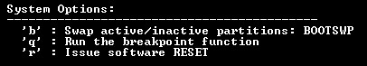 
_Figure 14. - System Options_ 

The 'b' command will perform a BOOTSWP. A successful bootswap can be seen by observing if the Active Partition and Inactive Partition switched at the top of the demo menu. See [BOOTSWP Instruction](#bootswp-instruction) for details. 

The 'q' command will run the breakpoint example, if in debug mode. If a breakpoint is set, this will hit the next breakpoint. The breakpoint function is simply a small function located at the same address for both partitions that does nothing and returns. The content of the function varies slightly between partition1 and partition2 so it's more obvious from which partition the function was run.

The 'r' command will issue a reset. This will swap the active and Inactive Partitions if the Inactive Partition has a lower sequence number than the Active Partition or if the Active Partition contains an invalid sequence number. 

## dsPIC33A Dual Partition Overview

Dual Partition mode allows for two independent applications to be programmed into the device, referred to as Partition 1 and Partition 2. On device startup, one of the partitions is mapped to the Active Partition and executed while the other is mapped to the Inactive Partition. Either Partition 1 or Partition 2 can be considered the Active Partition. The assignment of a partition to the Active or Inactive Partition is determined automatically by a code signature, known as the [Boot Sequence Number](#boot-sequence-number) (BTSEQn). 

The Active Partition is located at memory address 0x800000-0x81FFFE and the Inactive Partition is located at memory address 0xC00000-0xC1FFFE. The addresses of 0xC00000-0xC1FFFE can be thought of as "virtual addresses". These addresses do not exist in actual flash memory but rather are values used to reference and access the Inactive Partition memory space. 

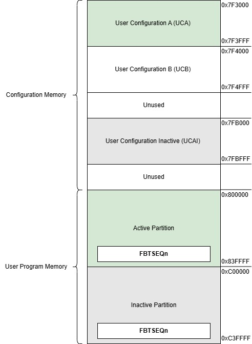 
_Figure 8. - Dual Partition Memory Map_ 

### Dual Partition Memory Mode

There are three dual partition memory modes available: Protected Dual Boot, Dual Boot, and Single Boot (default). This mode is set by programming the BTMODE configuration bit which is part of the UCB configuration area (see [User Configuration Sections](#user-configuration-sections)). 

Both Protected Dual Boot Mode and Dual Boot Mode allow for two separate partitions, however Protected Dual Boot Mode prevents page erases and programming in Partition 1 as well as writes when Partition 1 is mapped to the inactive address space. In comparison, Dual Partition Mode enforces no access restrictions on the partitions by default. In order to fully demonstrate the dual partition capabilities, Dual Boot Mode has been chosen for this project. 

### Boot Sequence Number

Each partition has an associated 12-bit boot sequence number (BTSEQ), stored at the last address of the active and inactive space. This value is used to automatically determine which partition is mapped to the Active Partition on device reset. The BTSEQ value contains the following, where BTSEQn is the actual boot sequence value and IBTSEQn is the one's complement of BTSEQn: 

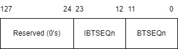 
_Figure 9. - Boot Sequence Number_ 

IBSEQn must be calculated and programmed by the application and is not automatically created by hardware. 

If BTSEQn [11:0] ≠ ~BTSEQn [23:12], the Boot Sequence Number word read results in an ECC DED error, or the Boot Sequence Number is unprogrammed, it is invalid.

### Assigning Active/Inactive Partitions

There are two ways to assign the Active and Inactive Partitions: comparing Boot Sequence Numbers or the BOOTSWP instruction.  

#### Comparing Boot Sequence Numbers

On device reset, the BTSEQn will be read from both partitions. These values are compared and the partition with the **lowest BTSEQn** value is mapped to the Active Partition. If a BTSEQn is invalid, it is assigned the highest possible value (0xFFF) for evaluation.

**NOTE**: If the Boot Sequence Number of Partition 1 and Partition 2 are equal, Partition 1 will be mapped to the Active Partition.

During runtime, the Boot Sequence Number(s) can be reprogrammed, and a reset can be executed to swap the partitions. 

#### BOOTSWP Instruction

The BOOTSWP instruction allows the Active and Inactive Partitions to be swapped without a reset (i.e. a "soft swap"). To perform the BOOTSWP instruction, the FICD.NOBTSWP configuration bit must first be enabled. Once enabled, a BOOTSWP can be performed by:

1. Clear the failed swap flag in case there was a previously failed BOOTSWP attempt. 
2. Load the Boot Sequence Number of the Inactive Partition into a working register.
3. Attempt to perform the BOOTSWP instruction on the working register containing the Inactive Partition Boot Sequence Number.
4. Load the program counter with the target being an address within 32 Kbytes of the current address. The Active and Inactive Partitions should now have traded places and the PC vectors to the location specified in Step 3.
5. Check the SFTSWP bit to verify the BOOTSWP executed correctly. 
6. If the swap passes, reset/jump to the entry point of the new Active Partition.

If the [BTSEQ validation](#boot-sequence-number) fails, the BOOTSWP will fail. In the case of a failed BOOTSWP, the instruction following the BOOTSWP will be executed from the currently active partition. 

**NOTE**: It is critical that the BOOTSWP and subsequent GOTO instruction exist at the exact same address in both partitions. 

See boot_swap.S in either partition1.X or partition2.X for a full bootswap implementation. 

### User Configuration Sections

In Dual Partition, there are three User Configuration sections mapped in memory: UCA, UCAI, and UCB (See Figure 5). UCA contains the storage device configuration bits for the Active Partition, UCB contains the calibration data and security/boot configuration bits including the flash protection region descriptor configurations, and UCI contains the storage device configuration bits for the Inactive Partition. 

UCB is shared by partitions 1 and 2 while UCA and UCAI are either UCA1 (User Configuration A Partition 1) or UCA2 (User Configuration A Partition 2), depending on which partition is currently active. In this demo, the UCB bits have been placed in Partition 1. 

#### Flash Protection Regions 

In this example, 4 Flash Protection Regions (PR0-PR3) have been defined and enabled in order to demonstrate the various protection scenarios when in dual partition mode. These regions are defined in Partition 1's config_bits.c file. As noted above, flash protection region configurations are mapped to UCB, therefore these configurations are valid for both Partition 1 and Partition 2. The regions are configured as follows: 

**PR0** 
* FPR0CTRL:
    * Partition Select: Both
    * Type: Firmware 
    * Read: Enabled 
    * Execute: Enabled
    * Write: Enabled
* FPR0ST/FPR0END:
    * Address Range (inclusive): 0x810000 - 0x811FFF

**PR1**
* FPR1CTRL:
    * Partition Select: Partition 2
    * Type: Firmware 
    * Read: Enabled 
    * Execute: Enabled
    * Write: Disabled
* FPR1ST/FPR1END:
    * Address Range (inclusive): 0x811000 - 0x811FFF

**PR2**
* FPR2CTRL:
    * Partition Select: Partition 1
    * Type: Firmware
    * Read: Enabled 
    * Execute: Enabled
    * Write: Enabled
* FPR2ST/FPR2END:
    * Address Range (inclusive): 0x812000 - 0x812FFF

**PR3**
* FPR3CTRL:
    * Partition Select: Partition 2
    * Type: Firmware 
    * Read: Enabled 
    * Execute: Enabled
    * Write: Disabled
* FPR3ST/FPR3END:
    * Address Range (inclusive): 0x812000 - 0x812FFF

The FPRnCTRL, FPRnST, and FPRnEND configuration bits are copied into the PRnCTRL, PRnST, and PRnEND SFRs on reset, respectively. PR0, PR1, PR2, and PR3 are set as Firmware, which allows for region locking/unlocking and permissions updates. 

 
_Figure 10. - Flash Protection Region Configuration_ 

**NOTE**: The PRnST and PRnEND registers are offset from 0x800000 and are page aligned (the lower bits are hardware restricted to force page alignment).

### Inactive Partition Erase 

The Inactive Partition (including UCA1/2 pages depending on which partition is currently mapped to the inactive space) can be erased using the inactive partition erase sequence. This can be performed by: 

1. Setting NVMADR to the Inactive Partition base address
2. Setting NVMCON to the partition erase opcode (0x4004)
3. Configuring NVMCON to word program 

### Inactive Partition Program

The entire Inactive Partition code can be updated by performing the following: 

1. Complete an [inactive partition erase](#inactive-partition-erase). 
2. Use page write to write each page of the Inactive Partition. 
3. Verify the data has been properly written (ex. perform/verify the CRC of the partition).
