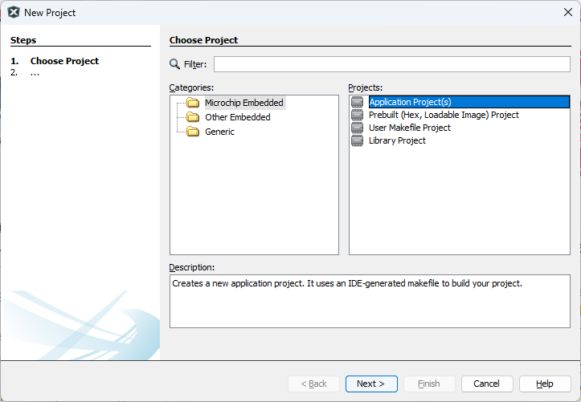
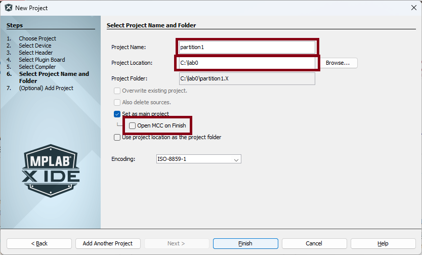
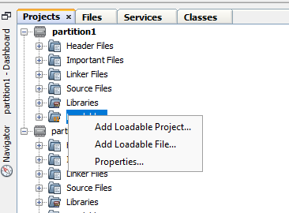
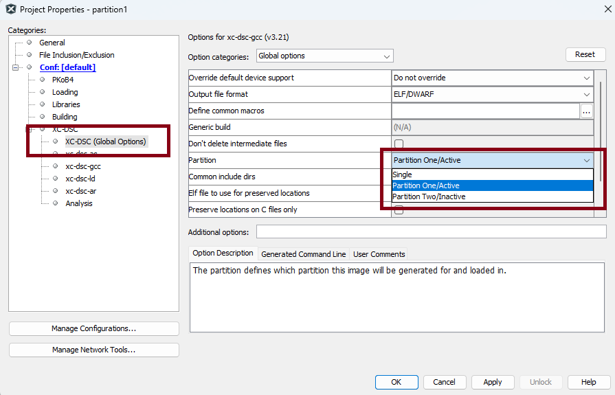
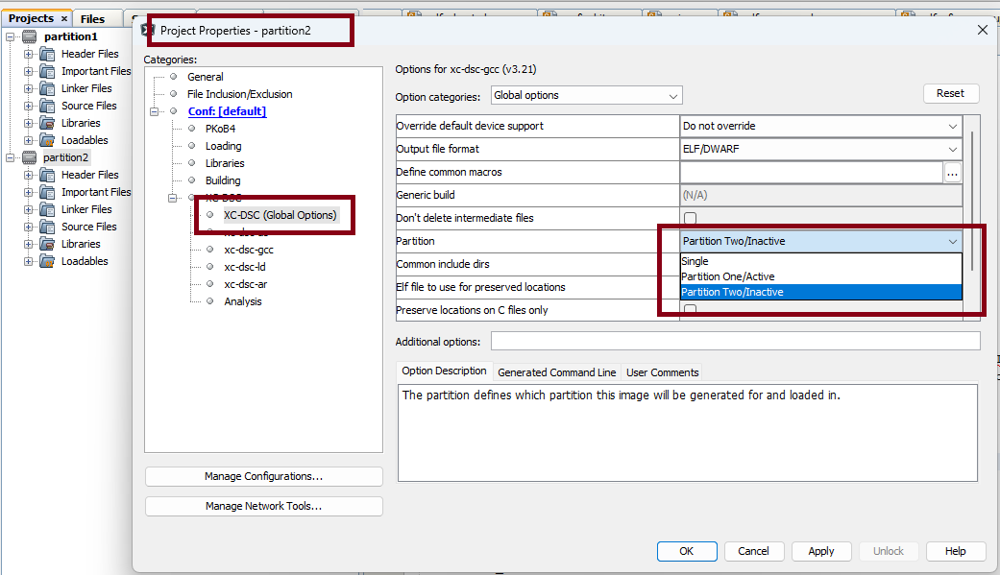
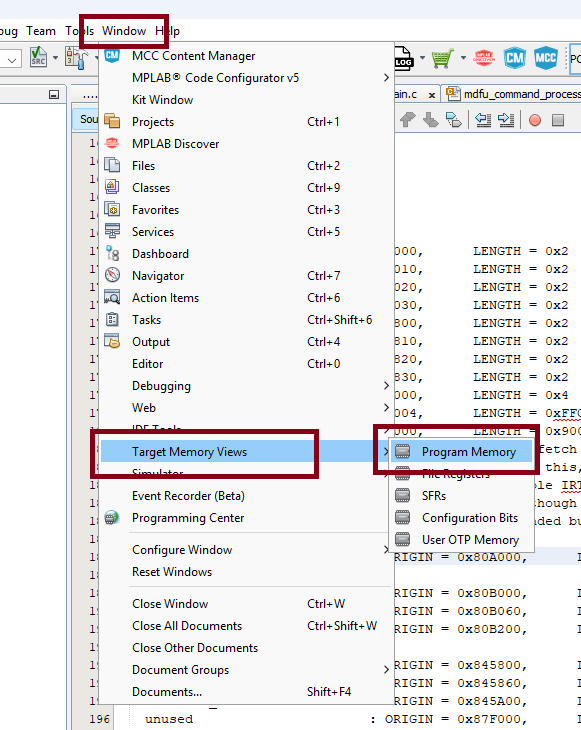
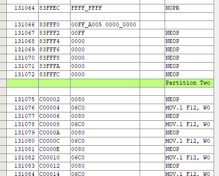

# Lab 0 - Project Creation
This lab shows how to create a set of projects to add code to both the active and inactive partitions.

## Required Software
* MPLAB X - v6.25 or later
* XC-DSC v3.21 or later

## Required Hardware
* Curiosity Platform Development Board (EV74H48A)
* dsPIC33AK512MPS512 DIM (EV80L65A)

## Setup
1. With the board unplugged, insert the DIM into the DIM socket.
2. Connect the board to the host PC through the USB-C connector.

## Lab
The objective of this lab is to show users how to create a project configuration that can program code into both the active and inactive partition of a dual partition device.  This can be useful for both debugging during development as well as the generation of production images that contain images for both partitions.

### Part 1 - Image for partition 1
In this section we will create a set of code for partition 1.

1. In MPLAB X, click File->New Project
2. Select "Microchip Embedded -> Application Project(s)" in new project window and click 'Next'.<br>
3. Select the 'dsPIC33AK512MPS512' in the device selection drop-down and click 'Next'.
4. Select the installed version of XC-DSC and click 'Next'.
5. Put 'partition1' for the project name field.  Select the folder where you want the project to live. Uncheck the "Open MCC on Finish" checkbox.  Click 'Finish'.<br>
6. Create a new main.c file and add it to the project.
7. Update main.c to have the following code:<br>
```
    #include <xc.h>
    
    #pragma config FBOOT_BTMODE = DUAL    //Device Boot Mode Configuration bits->Device is in Dual Boot mode
    
    volatile static const uint32_t sequenceNumber[4] __attribute__((space(prog), address(0x83FFF0), keep)) = { 0x00FFA005, 0x00000000UL, 0x00000000UL, 0x00000000UL };
    
    int main(int argc, char** argv) 
    {
        TRISCbits.TRISC8 = 0;
        LATCbits.LATC8 = 1;   //turn on LED0
        
        while(1)
        {
        }
        
        return 0;
    }
```
8. Compile and program the code.  LED0 should turn on.

Items to note in the example above:
* We have defined one configuration bit FBOOT_BTMODE.  This bit tells the device to operate in dual or single partition modes.
* We have create a sequence number for this partition located in the last 128-bits of the memory of the partition with a value of '5'.

### Part 2 - Image for partition 2
In this section we will create a set of code for partition 2.

1. In MPLAB X, click File->New Project
2. Select "Microchip Embedded -> Application Project(s)" in new project window and click 'Next'.
3. Select the 'dsPIC33AK512MPS512' in the device selection drop-down and click 'Next'.
4. Select the installed version of XC-DSC and click 'Next'.
5. Put 'partition2' for the project name field.  Select the folder where you want the project to live. Uncheck the "Open MCC on Finish" checkbox.  Click 'Finish'.
6. Create a new main.c file and add it to the project.
7. Update main.c to have the following code:<br>
```
    #include <xc.h>
        
    volatile static const uint32_t sequenceNumber[4] __attribute__((space(prog), address(0x83FFF0), keep)) = { 0x00FFB004, 0x00000000UL, 0x00000000UL, 0x00000000UL };
    
    int main(int argc, char** argv) 
    {
        TRISCbits.TRISC15 = 0;
        LATCbits.LATC15 = 1;    //turn on LED7
        
        while(1)
        {
        }
        
        return 0;
    }
```

Items to note in the example above:
* We have NOT defined the FBOOT_BTMODE configuration bit in this project.  In the dsPIC33A devices there are 3 configuration bit sections: a configuration section for the entire device (UCAB), and configuration sections specific to each partition (UCA1 and UCA2).  The FBOOT_BTMODE is a device level configuration bit and can only be defined in the partition 1 project.  
* We have create a sequence number for this partition located in the last 128-bits of the memory of the partition with a value of '4'.  Because this is lower than the '5' sequence number of partition 1, when run in a dual partition mode, partition 2 should be the partition to run out of reset (the lowest valid sequence number is the active partition).
* At this point of time if you programmed this into the device, it would program into partition 1.  In the next section we go through the steps that will change this code to link into partition 2.

### Combining the two projects
At this point we have two projects, one for each partition.  In this step we will combine the two projects so that both sets of code are loaded into the device at the same time and into the correct partitions.

1. Set your partition1.X as your main project.
2. Right click on the "Loadables" folder and select "Add Loadable Project".<br>
3. Navigate to and select the partition2.X project.
4. Right click on the partition1.X project in MPLAB X and select "Properties".
5. Select the "XC-DSC (Global Options)" under the "XC-DSC" node.
6. In the "Partition" option, select: "Partition One/Active".  Apply and accept. <br>
7. Right click on the partition2.X project in MPLAB X and select "Properties".
8. Select the "XC-DSC (Global Options)" under the "XC-DSC" node.
9. In the "Partition" option, select: "Partition Two/Inactive".  Apply and accept. <br>
10. Compile and program the demo.  You should see that even though you have partition1.X as the active project, that the code from partition2.X is running.  This is because the device has determined that partition 2 has newer code and ran this code on reset.
11. Open the main.c file in the partition1.X file and change the sequence number to 0x00FFE001.  
12. Compile and program the demo.  You should see that you are now running the code from the partition2.X project.  This shows that partitions are programmed into the device and the sequence number is determining on reset which partition should run.  The lower number sequence number is the one run at reset and the sequence number in the partition2.X main.c is lower than the one in the partition1.X main.c.
13. Open the Program Memory View by going to "Window -> Target Memory View -> Program Memory" from the MPLAB X menu options.<br>
14. Scroll to around address 0x800600.  You can see there is code in memory.
15. Scroll to address 0x83FFF0.  You can see the sequence number from partition1.X in memory.
16. Just below the sequence number, you can see it says "Partition Two" and the address jumps to 0xC000000.<br>
17. Scroll down to 0xC00600 and you can see there is similarly code in memory for partition 2.

In this section we saw how you can create a loadable project that can load code into both partitions of the device at the same time when developing in a dual partition configuration.

### Additional Experiments and Learning
This lab covers how to create a project that generates code into both partitions when compiled.  Additional learning on sequence numbers, configuration bits, live swapping the active partition, and other topics are available in other labs.  The sequence number lab will cover sequence numbers in more detail, but it might be interesting to explore changing the sequence numbers in both main.c files to show the device starting in different partitions based on the sequence number.


