# Lab 1 - Sequence Numbers
This lab is designed to walk through understanding how the sequence numbers work on reset when in dual partition mode.

## Required Software
* Serial terminal program
* MPLAB X - v6.25 or later
* XC-DSC v3.21 or later

## Required Hardware
* Curiosity Platform Development Board (EV74H48A)
* dsPIC33AK512MPS512 DIM (EV80L65A)

## Setup
1. With the board unplugged, insert the DIM into the DIM socket.
2. Connect the board to the host PC through the USB-C connector.
3. Reset example0 projects. This lab is designed to use the example0 project as the base for all of steps below.  Please make sure that any prior modifications to the example from other labs have been reverted. Changes made in other labs might impact the behavior of this lab.
4. Open terminal program to the following settings: 460800 8-n-1.

## Lab

### Part 1 - Exploring how to generate the sequence number in code
In this part of the lab, we explore the default sequence numbers in both the active and inactive partitions and how these can be set in code.

1. Open the example0/partition1.X MPLAB X project.
2. Compile and program the example. A menu should print on the screen. In the menu is a section that shows the current partition information and the associated sequence numbers. Note that it shows that the current partition is partition 1. 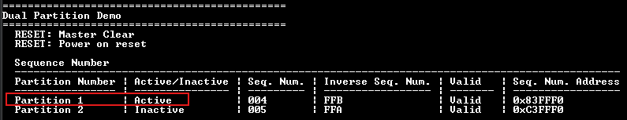
3. Open the sequence_number.c file in example0/partition1.X project.  Compare the sequence number in the code to the terminal.  Note the that the sequence number string is the last 128-bits of the partition.  The sequence number contains the actual boot sequence value (BTSEQn) and the one's complement of BTSEQn.  If BTSEQn [11:0] ≠ ~BTSEQn [23:12], the sequence number word read results in an ECC DED error, or the sequence number is unprogrammed, it is invalid. 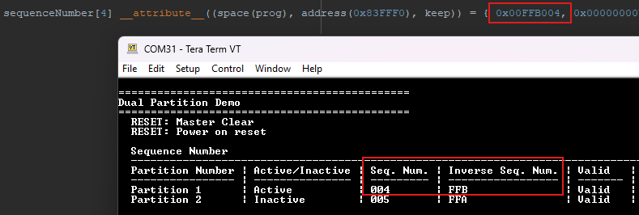
4. Open the sequence_number.c file in example0/partition2.X project.  Compare the sequence number in the code to the terminal. 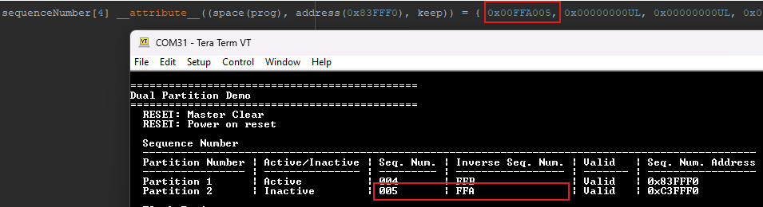
5. Reset the board by pressing the MCLR button or the 'r' key in the terminal.  Note that on reset, partition 1 is the active partition. 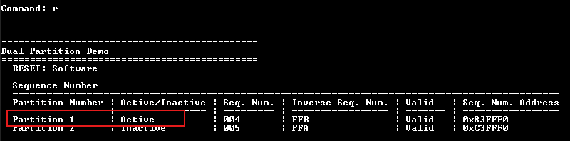

### Part 2 - Changing the active partition using the sequence number
In this part, we will switch which partition is the active partition by updating the sequence numbers.  First, partition 2 is made the active partition.  Next, partition 1 is made the active partition again.

1. Compile and program the example.
2. With the terminal window selected, enter capital 'S'.  
3. Type the following sequence: 'FFC003'.  This will change the sequence number of the inactive panel to '3'.  This will be lower than the current sequence number in partition 1. 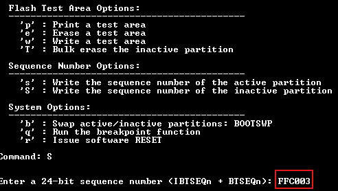
4. Note that the inactive partition, partition 2, now has the sequence number 'FFC003' 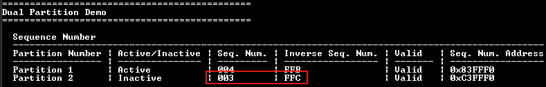
5. Reset the device by either pressing the reset button or the 'r' key in the terminal. Note that on reset, partition 2 is now the active partition. The lowest sequence number is the panel that will start on reset. 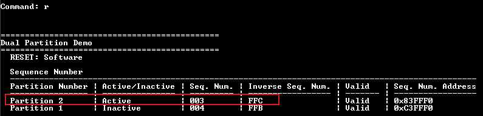

Because partition 2 has the lower sequence number, on reset it automatically becomes the active partition.

6. Enter capital 'S' again to update the inactive partition sequence number (partition 1 is inactive).
7. Type the following sequence: 'FFD002'.  This will change the sequence number of the inactive panel to '2'. 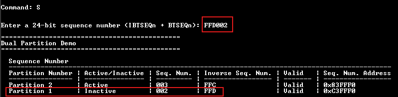
8. Reset the board by pressing the MCLR button or the 'r' key in the terminal.  Note that on reset, partition 1 is the active partition. 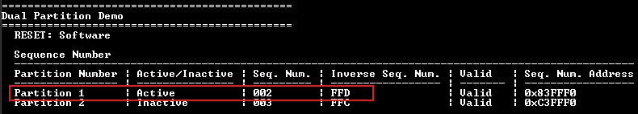

In this section, we saw how the lowest sequence number of the two partitions becomes the active partition after a reset.  We can change which partition is active based on how these sequence numbers are programmed into the last 128-bits of the partition memory.

### Part 3 - Invalid sequence numbers
Each sequence number is made up of BTSEQn, IBTSEQn, and padding to form a valid sequence number.  If the IBTSEQn doesn't match the corresponding BTSEQn, then it is an invalid sequence number and isn't considered during the reset sequence to determine which partition to book.  If both partitions are invalid, partition 1 is selected as the default active partition.

1. Compile and program the example.
2. Enter capital 'S' to update the inactive partition sequence number (partition 2 is inactive)
3. Type the following sequence: 'FFF001'.  This is an invalid sequence number. The check value 'FFF' doesn't match the sequence number '001'. Note that the screen indicates that partition 2 in invalid. 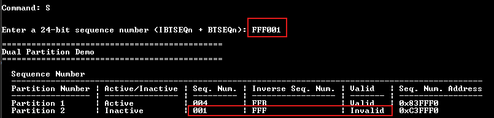
4. Reset the board by pressing the MCLR button or the 'r' key in the terminal.  Note that on reset, partition 1 is still the active partition.  Even though the number is lower, because the sequence check fails, partition 1 is the active partition. 

5. Enter capital 'S' to update the inactive partition sequence number (partition 2 is inactive)
6. Type the following sequence: 'FFE001'.  This will change the sequence number of the inactive panel to '1'. 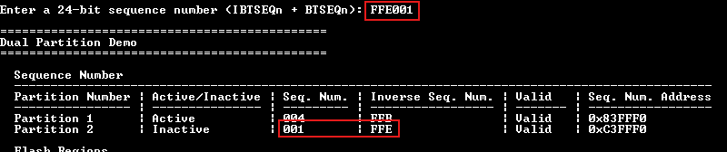
7. Reset the board by pressing the MCLR button or the 'r' key in the terminal.  Note that on reset, partition 2 is the active partition. 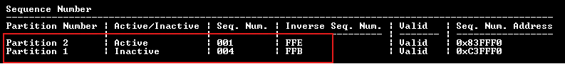

This shows how the lowest valid sequence number is used to determine the active partition on reset.  

### Part 4 - Equal sequence numbers
This section demonstrates how equal partition numbers are handled.  When the sequence number of two partitions are equal and both valid, partition 1 is the default active partition.

1. Compile and program the example.
2. Enter capital 'S' to update the inactive partition sequence number (partition 2 is inactive)
3. Type the following sequence: 'FFB004'.  This will change the sequence number of the inactive panel to '4'.  Note that the sequence number of both partitions are identical and that partition 2 is the current active partition. 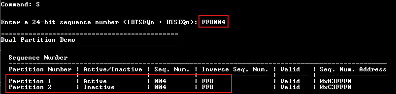
4. Reset the board by pressing the MCLR button or the 'r' key in the terminal.  Note that on reset, partition 1 is now the active partition.  In the case of a tie of valid sequence numbers, partition 1 is the default partition. 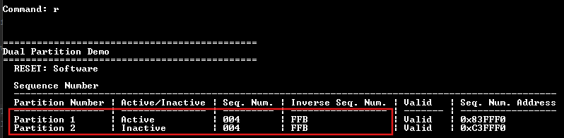

### Additional Exploration
In these labs we have modified the sequence numbers through self programming.  Here are a list of other possible interesting tests to explore:
* Modify the sequence number in the example0/partition2.X project to have a lower sequence number.  Note which partition is active after reset.
* Modify both sequence numbers in example0/partition1.X and example0/partition2.X to invalid sequence numbers.  Note which partition is active after reset.
* Use the terminal window to modify the sequence numbers as we've done above.  Click the "Read Device" button in MPLAB X.  Open the program memory view and explore the sequence numbers in memory.

At the end of your exploration, reset the example0/partition1.X and example0/partition2.X projects so that they can be used for the next labs.
