# Lab 2 - Flash Protection Regions
This lab is designed to explore flash protection regions and their behavior in dual partition mode.

The current flash protection region configurations are diagrammed below for reference throughout the lab. These settings can also be viewed in partition1 &rarr; Source Files &rarr; config_bits.c.
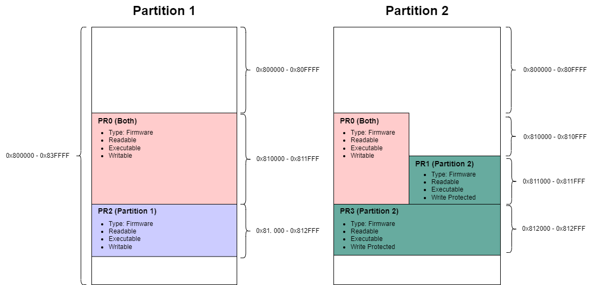 

## Required Software
* Serial terminal program
* MPLAB X - v6.25 or later
* XC-DSC v3.21 or later

## Required Hardware
* Curiosity Platform Development Board (EV74H48A)
* dsPIC33AK512MPS512 DIM (EV80L65A)

## Setup
1. With the board unplugged, insert the DIM into the DIM socket.
2. Connect the board to the host PC through the USB-C connector.
3. Reset example0 projects. This lab is designed to use the example0 project as the base for all of steps below. Please make sure that any prior modifications to the example from other labs have been reverted. Changes made in other labs might impact the behavior of this lab.
4. Open the config_bits.c file associated with partition1.X. This is located in MPLAB X under partition1 &rarr; Source Files &rarr; config_bits.c.
5. Navigate to the FIRT_IRT bit and set this to "ON" to enable the Immutable Root of Trust (IRT) regions.  
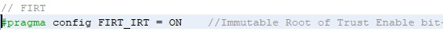 
6. Open a terminal program to the following settings: 460800 8-n-1.

## Lab Steps

### Overlapping Regions
Each flash protection region defined in config_bits.c has a partition select bit called 'FPRnCTRL_PSEL', where 'n' is the region number. This bit controls which partition the region will apply to: PANEL1, PANEL2, or BOTH. 

When running in dual boot mode, it's possible to have overlapping flash protection regions with different FPRnCTRL_PSEL values. In the following examples, we'll explore how overlapping regions impact permissions.  

#### Part 1
The following steps will show how overlapping flash protection regions work when both regions apply to the same partition and have differing permissions. 

We'll be working with PR0 and PR1, where:

**PR0**
* Type: Firmware
* Read: Enabled
* Execute: Enabled
* Write: Enabled
* Partition: Both
* Address range: 0x810000 - 0x811FFF

**PR1**
* Type: Firmware
* Read: Enabled
* Execute: Enabled
* Write: Disabled
* Partition: 2
* Address range: 0x811000 - 0x811FFF

1. Open the example0/partition1.X MPLAB X project.
2. Compile and program the example. A menu should print on the screen. 
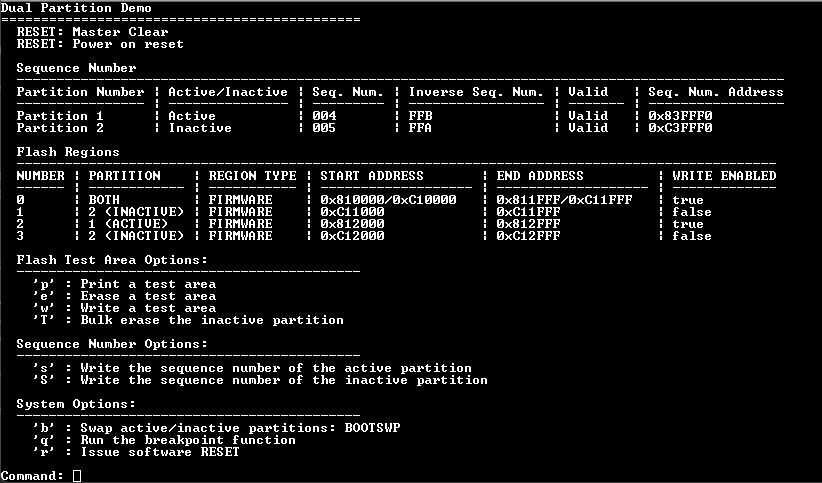 
3. Enter 'b' to swap the active/inactive partitions. Note that Partition 2 is now active. 
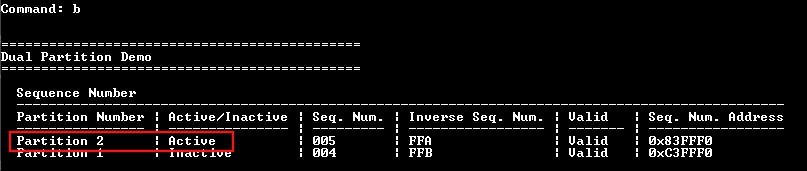
3. Enter 'e' to try and erase a page in a flash protection region. A menu will display with address options. 
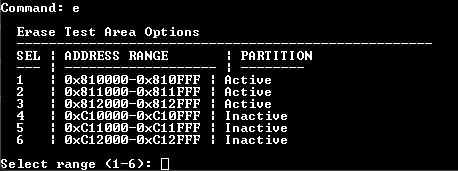
4. Enter '2' to target the region where PR0 and PR1 overlap. 
5. Despite PR0 having writes enabled, the erase fails because PR0 overlaps with PR1, which is write/erase protected. 
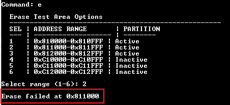
6. Reset the device by either pressing the reset button or the 'r' key in the terminal. Note that Partition 1 is once again the active partition. 
7. Repeat steps 3 and 4. This time, the erase succeeds. Because Partition 1 is active, PR1 no longer restricts the selected address range. The operation is instead governed by PR0, which allows write/erase access. 
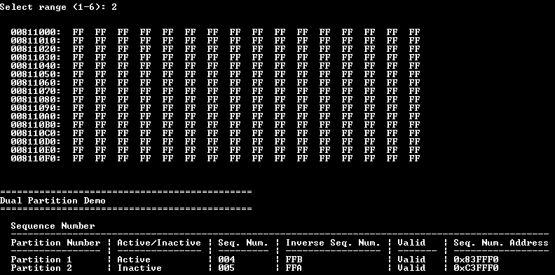

#### Part 2
The following steps demonstrate how overlapping flash protection regions work when the regions apply to different partitions and have differing permissions.  

We'll be working with PR2 and PR3, where:

**PR2**
* Type: Firmware
* Read: Enabled
* Execute: Enabled
* Write: Enabled
* Partition: 1
* Address range: 0x812000 - 0x812FFF

**PR3**
* Type: Firmware
* Read: Enabled
* Execute: Enabled
* Write: Disabled
* Partition: 2
* Address range: 0x812000 - 0x812FFF

1. Open the example0/partition1.X MPLAB X project.
2. Compile and program the example. A menu should print on the screen. 
  
Note in the terminal that partition 1 is active.  
3. Enter 'e' to try and erase a page in a flash protection region. 
4. Enter '3' to target PR2. The erase should succeed. Although PR3 overlaps the same address range and has writes disabled, PR3 applies only to Partition 2. Since Partition 1 is active, the operation is governed by PR2, which has write/erase enabled.

### Partition Erase
The partition erase function erases the inactive partition including the UCA1 and UCA2 pages (depending on which partition is currently mapped to the inactive space). In the following examples, we'll walk through the partition erase function and how flash protection regions can impact the ability to perform a partition erase.

#### Part 1
The following steps will show the partition erase functionality and how flash protection regions can prevent a partition erase. 

We'll be working with PR1 and PR3, where:

**PR1**
* Type: Firmware
* Read: Enabled
* Execute: Enabled
* Write: Disabled
* Partition: 2
* Address range: 0x811000 - 0x811FFF

**PR3**
* Type: Firmware
* Read: Enabled
* Execute: Enabled
* Write: Disabled
* Partition: 2
* Address range: 0x812000 - 0x812FFF

1. Open the example0/partition1.X MPLAB X project.
2. Compile and program the example. A menu should print on the screen. 
  
Note in the terminal that partition 1 is active.  
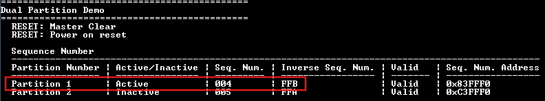 
3. Enter capital 'T' to try and bulk erase the inactive partition (partition 2). This should fail. PR1 and PR2 are write/erase protected and apply to partition 2, preventing the partition erase.
4. Open partition1 &rarr; Source Files &rarr; config_bits.c. Update PR1 and PR3 to allow for write and erase operations. 
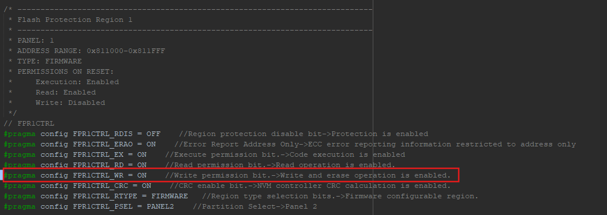 
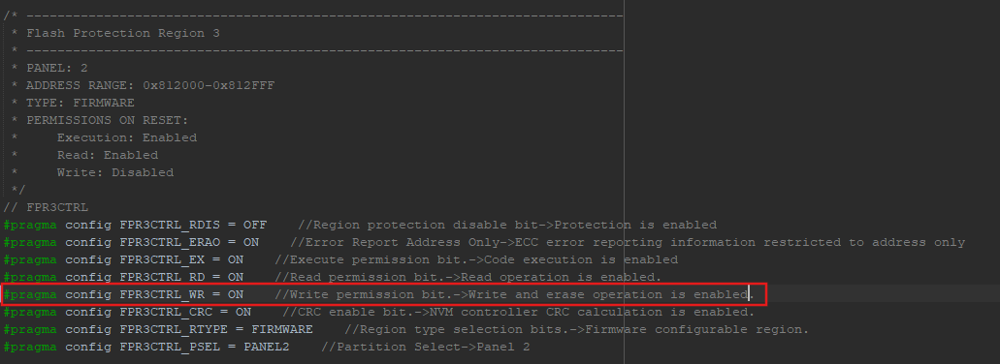 
5. Re-program the example. Note that writes are now enabled for PR1 and PR3. 
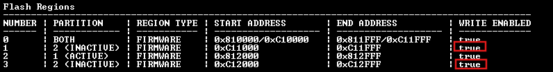
9. Enter capital 'T' to try and erase the inactive partition (partition 2). This should successfully erase the inactive partition. Note that the partition 2 sequence number is now all 0xF. 
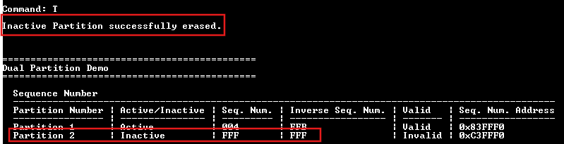 

At the end of your exploration, reset the example0/partition1.X and example0/partition2.X projects so that they can be used for the next labs.