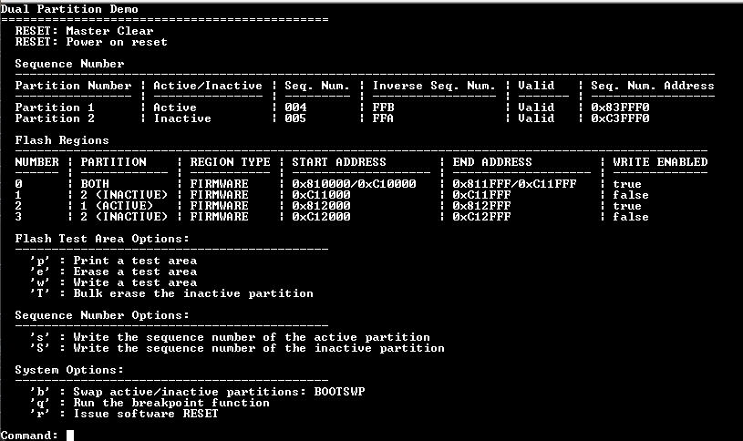
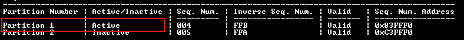
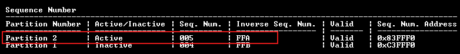
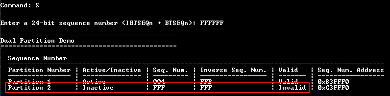
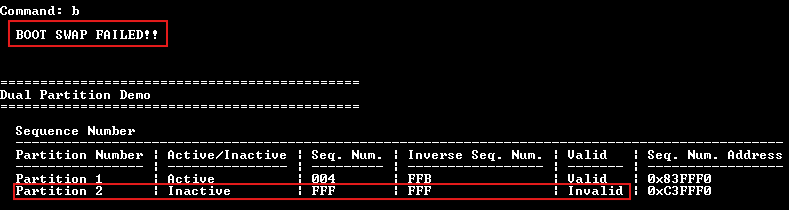
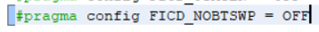
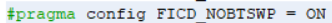
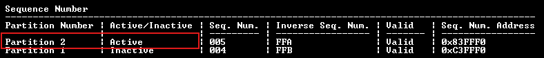
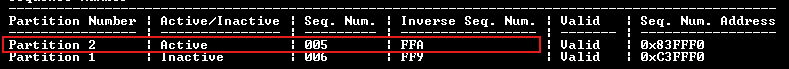
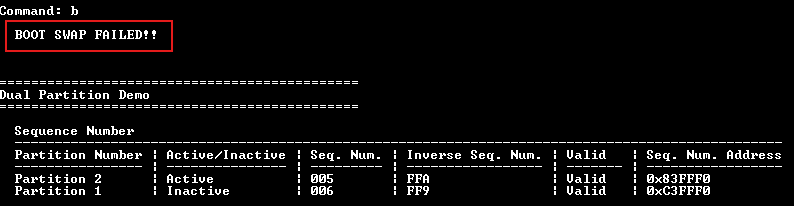

# Lab 3 - BOOTSWP Instruction
This lab is designed to explore the BOOTSWP instruction, which allows for the inactive and active partitions to be swapped without a reset.

## Required Software
* Serial terminal program
* MPLAB X - v6.25 or later
* XC-DSC v3.21 or later

## Required Hardware
* Curiosity Platform Development Board (EV74H48A)
* dsPIC33AK512MPS512 DIM (EV80L65A)

## Setup
1. With the board unplugged, insert the DIM into the DIM socket.
2. Connect the board to the host PC through the USB-C connector.
3. Reset example0 projects. This lab is designed to use the example0 project as the base for all of steps below. Please make sure that any prior modifications to the example from other labs have been reverted. Changes made in other labs might impact the behavior of this lab.
4. Open a terminal program to the following settings: 460800 8-n-1.

## BOOTSWP Instruction Overview

The BOOTSWP instruction allows the active and inactive partitions to swap without updating the sequence number value and performing a reset. This is also known as a "soft swap". The BootSwap function for this demo can be reviewed in partition1.X/partition2.X &rarr; Source Files &rarr; boot_swap.S.

To perform a BOOTSWP instruction:
* Load the inactive partition sequence number into a W-reg.  
* Perform the BOOTSWP instruction on the inactive partition sequence number. 
* Immediately after the BOOTSWP instruction, perform a single-word instruction that writes the program counter (e.g. GOTO W, CALL W, or BRA W). 
* The target of the single-word instruction must be within 32KB of the current instruction. 
* Optionally, read the SFTSWP bit to ensure the BOOTSWP instruction executed correctly. This bit is set automatically after a successful BOOTSWP instruction. 
* Optionally, read the P2ACTIV bit to verify which partition is currently active and to ensure the BOOTSWP instruction swapped the partitions. 
* If the BOOTSWP instruction was successful, jump to the entry point of the new partition's code. 
* If the BOOTSWP instruction failed, return to the point where the swap was attempted or perform another recovery mechanism. 

**NOTE**: The FICD.NOBTSWP bit in config_bits.c must be enabled to perform a BOOTSWP. The FICD register is within the CFGA1 and CFGA1 configuration regions and therefore must be set in both partitions. See [Part 3](#part-3) for additional details. 

**NOTE**: The BOOTSWP and subsequent single-word instruction MUST exist at the exact same address in both partitions. 

## Lab Steps

### Part 1
In this section, we'll explore how the BOOTSWP instruction works when both sequence numbers are valid. 

1. Open the example0/partition1.X MPLAB X project.
2. Compile and program the example. A menu should print on the screen. Note that partition 1 is currently active. 
 
 
3. Enter 'b' to perform a BOOTSWP. Note that partition 2 is now active, despite having a larger sequence number. (See the Sequence Number lab or README for more details on sequence numbers). 
 
4. Enter 'r' to reset the device. Note that partition 1 (which has the lower sequence number) is the active partition again. 
 

### Part 2
In this section, we'll explore how the BOOTSWP instruction works when the sequence number of the inactive partition is invalid. 

1. Open the example0/partition1.X MPLAB X project.
2. Compile and program the example. A menu should print on the screen. Note that partition 1 is currently active. 
 
 
2. Enter capital 'S' to update the sequence number of the inactive partition. When prompted for a new sequence number, enter 'FFFFFF'. Note that the sequence number of the inactive partition (partition 2) is now showing as invalid.  

2. Enter 'b' to perform a BOOTSWP. Note that the BOOTSWP fails because the partition 2 sequence number is invalid.  

### Part 3
In this section, we'll explore the FICD.NOBTSWP bit and how disabling it in partition 1 and partition 2 impacts the ability to perform a bootswap. 

1. Open config_bits.c in partition1.x. This is located at partition1.X &rarr; Source Files &rarr; config_bits.c.
2. Disable the FICD.NOBTSWP bit.  

3. Re-program the example. The menu should re-print on the screen. Note that partition 1 is currently active. 
 

4. Enter 'b' to perform a bootswap. Note that the bootswap fails because the currently loaded configuration bits (UCA1) contain the disabled FICD.NOBTSWP bit. Although UCA2 still has the FICD.NOBTSWP bit enabled, it is only loaded on reset if partition 2 has a lower sequence number than partition 1, or if partition 2 has a valid sequence number while partition 1 has an invalid sequence number.
5. Re-open config_bits.c in partition1.x.
6. Re-enable the FICD.NOBTSWP bit.  

7. Open config_bits.c in partition2.x. This is located at partition2.X &rarr; Source Files &rarr; config_bits.c.
8. Disable the FICD.NOBTSWP bit.  

9. Re-program the example. The menu should re-print on the screen. Note that partition 1 is currently active. 
 

10. Enter 'b' to perform a bootswap. Note that the bootswap is successful and partition 2 is now the active partition. As noted above, the configuration bits of partition 2 will only be loaded on a reset if it is the active partition. Currently, the partition 1 configuration bits are loaded, which has bootswap enabled.  

11. Enter 'b' to perform a bootswap. Note that the bootswap is again successful and partition 1 is now the active partition.  

12. Enter 'b' to perform a bootswap once more. Note that the bootswap is again successful and partition 2 is once again the active partition.  

13. Enter capital 'S' to write the sequence number of the inactive partition (partition 1). 
14. Enter 'FF9006'. Note that this value is higher than the sequence number of partition 2 and should therefore result in partition 2 being mapped to the active partition on reset. See the sequence number lab or the README for additional details on the boot sequence number. 
15. Enter 'r' to reset. Note that on reset, partition 2 is the active partition.  

16. Enter 'b' to perform a bootswap. This should fail because partition 2 was mapped to the active partition on reset. As a result, the UCA2 configuration bits were loaded, which contain the disabled FICD.NOBTSWP bit, preventing a bootswap. 

At the end of your exploration, reset the example0/partition1.X and example0/partition2.X projects so that they can be used for the next labs.