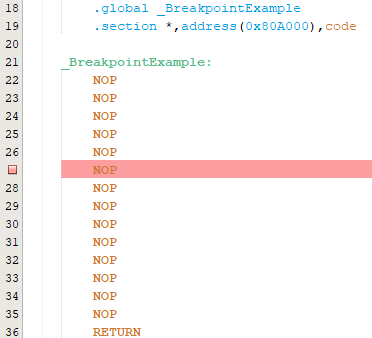
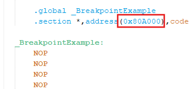
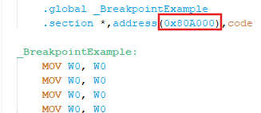
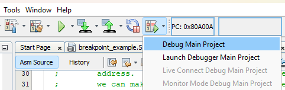
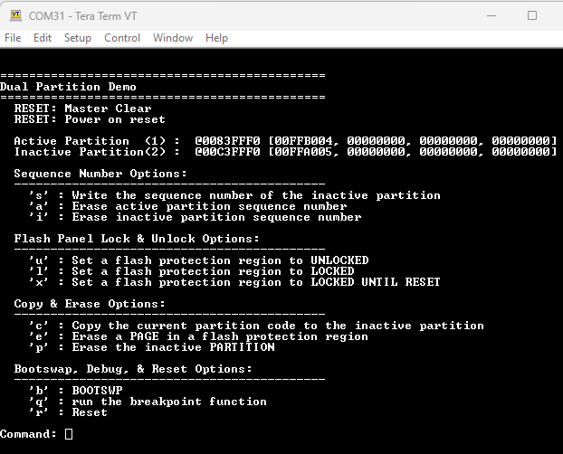
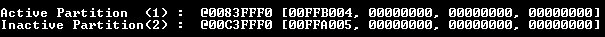
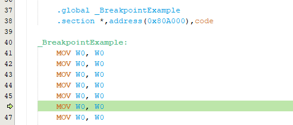
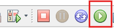
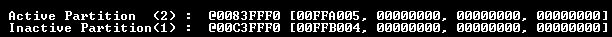
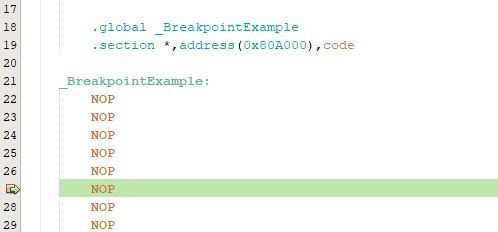

# Lab 4 - Debugging and Breakpoints
This lab is designed to explore debugging and setting breakpoints when in Dual Boot mode.

## Required Software
* Serial terminal program
* MPLAB X - v6.25 or later
* XC-DSC v3.21 or later

## Required Hardware
* Curiosity Platform Development Board (EV74H48A)
* dsPIC33AK512MPS512 DIM (EV80L65A)

## Setup
1. With the board unplugged, insert the DIM into the DIM socket.
2. Connect the board to the host PC through the USB-C connector.
3. Reset example0 projects. This lab is designed to use the example0 project as the base for all of steps below. Please make sure that any prior modifications to the example from other labs have been reverted. Changes made in other labs might impact the behavior of this lab.
4. Open a terminal program to the following settings: 460800 8-n-1.

## Overview 

Debugging and breakpoints function the same way in Dual Boot mode as they do in Single Boot mode, with no special configurations needed to debug the partitions. However, there are a few important considerations to keep in mind.

Breakpoints are address-based and not partition-aware. This means that a breakpoint set in the inactive partition can still be triggered when running the active partition if the address of that breakpoint is executed in the active partition. For instance, if a section is created in the inactive partition at address 0x801000 and a breakpoint is set there, the code will break at this location in the active partition when it executes address 0x801000, even though the breakpoint was originally set in the inactive partition file.

To better demonstrate this behavior, a file named breakpoint_example.S has been added to both partition1.X and partition2.X. Each file contains a function called BreakpointExample located at address 0x80A000. Although this function does nothing and simply returns, it serves to illustrate that a breakpoint set in the inactive partition will be triggered if the BreakpointExample function is executed in the active partition. We will walk through this behavior in the following steps. 

## Lab Steps

1. Open the example0/partition1.X MPLAB X project. partition2.X should open automatically. 
2. Open partition2.X &rarr; Source Files &rarr; breakpoint_example.S. 
3. Place a breakpoint on any of the NOP instructions in the file. Note this function is placed at 0x80A000.  
 
 
4. Open partition1.X &rarr; Source Files &rarr; breakpoint_example.S. Note that this function is also placed at 0x80A000 and contains slightly different contents in order to more easily differentiate the two breakpoint_example.S files. 
 
5. Click the "Debug Project" button in MPLAB X to debug partition1.x. A menu should print on the screen. Note that partition 1 is currently active. 
 
 
 
6. Enter 'q' to run the breakpoint function. The code should halt in partition 1's breakpoint_example.S, despite there being no breakpoint in this location.  
 
As mentioned in the overview, this occurs because breakpoints are address-based and not partition-aware. The BreakpointExample function is located at address 0x80A000 in both partition 1 and partition 2. A breakpoint was set in breakpoint_example.S of partition 2 (inactive), and when this address was executed in partition 1 (active), the breakpoint was triggered. However, the code being executed in the active partition is displayed for debugging purposes. 
7. Hit the "Continue" button to continue running the code.  
 
8. Enter 'b' to perform a bootswap. This will swap the partitions, making partition 2 the active partition.  
 
9. Enter 'q' to run the breakpoint function. Now that we are in partition 2, the breakpoint placed in Step 4 should now be hit and partition 2's breakpoint_example.S file should be displayed.  
 

At the end of your exploration, reset the example0/partition1.X and example0/partition2.X projects so that they can be used for the next labs.