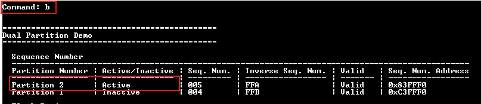
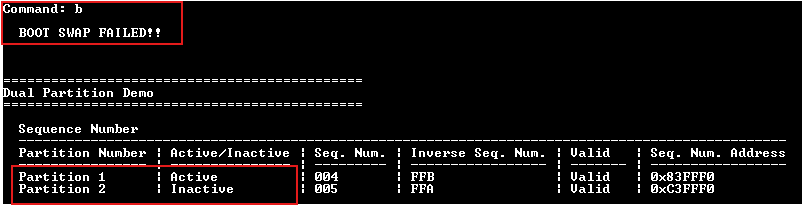
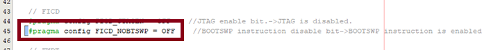
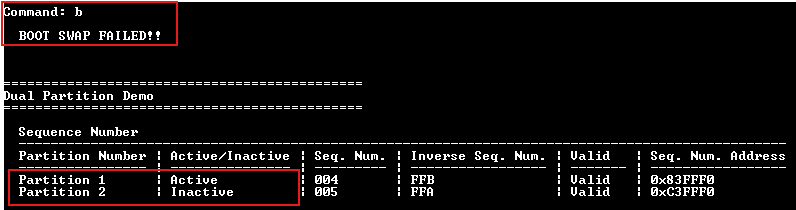
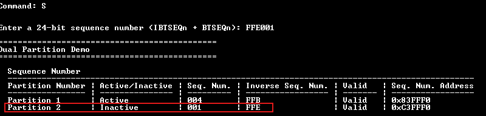
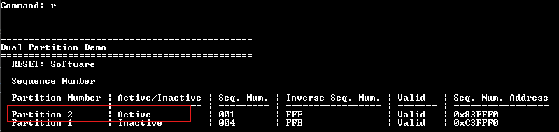
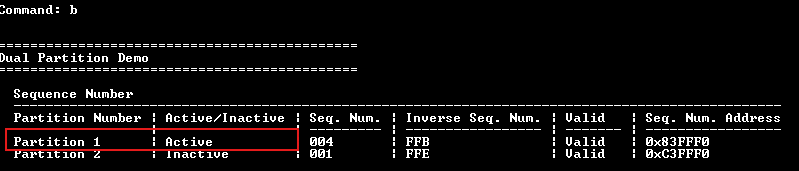
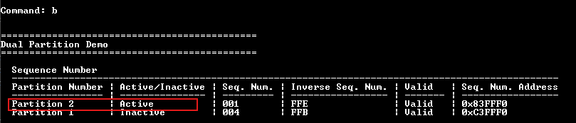

# Lab 5 - Configuration Bits
This lab is designed to explore how configuration bits are handles and applied in Dual Boot mode for the dsPIC33A products.

## Required Software
* Serial terminal program
* MPLAB X - v6.25 or later
* XC-DSC v3.21 or later

## Required Hardware
* Curiosity Platform Development Board (EV74H48A)
* dsPIC33AK512MPS512 DIM (EV80L65A)

## Setup
1. With the board unplugged, insert the DIM into the DIM socket.
2. Connect the board to the host PC through the USB-C connector.
3. Reset example0 projects. This lab is designed to use the example0 project as the base for all of steps below. Please make sure that any prior modifications to the example from other labs have been reverted. Changes made in other labs might impact the behavior of this lab.
4. Open a terminal program to the following settings: 460800 8-n-1.

## Overview 

In the dsPIC33A device family, there are 3 sets of configuration bits in the device:
* UCA1 is the configuration bit settings for partition 1.
* UCA2 is the configuration bit settings for partition 2.
* UCAB are the device level configuration bits that apply regardless of the partition that is loaded on reset.

It is important to note that UCA1 and UCA2 are loaded on device reset based on the which partition is loaded based on their sequence numbers.  The UCA configuration bits are set on reset only and are not updated during boot swap operations.  Thus the configuration bit settings in UCA2 will not apply to the device if the device resets into partition 1 and swaps to partition 2.  

## Lab

### Part 1 - Configuration bit definition in loadable projects
The objective of this section is just to show how the UCA1, UCA2, and UCB bits are defined in a loadable project.

1. Open the example0/partition1.X MPLAB X project.
2. Open the config_bits.c file.  Note the configuration bits in the FCP, FICD, and FWDT configuration registers.  These are in the UCA1 configuration space.  
3. Note other configuration bits defined in config_bits.c  These configuration bits are in the UCB configuration space.  The UCB configuration bits are only allowed to be defined in a project that targets partition 1.  Refer to the datasheet for additional information about which configuration bits are located in each configuration space to become familiar with how this is documented/specified.
4. Open the example0/partition2.X MPLAB X project.
5. Open the config_bits.c file.  Note the configuration bits in the FCP, FICD, and FWDT configuration registers.  These are in the UCA2 configuration space.  NOTE: the configuration bit names are identical to those in the partition1.X file.  The determining factor if these are loaded into UCA1 or UCA2 is if they are in a project that configured in the build settings to be targeting partition 2 (as described in lab0).  NOTE: only the FCP, FICD, and FWDT are defined in the partition2.X project configuration bits file.  As mentioned in step 3, the UCB configuration bits are only allowed to be defined in a project targeting partition 1.  Defining configuration bits targeting UCB will result in a build warning and the value being ignored.

### Part 2 - Disabling the BOOTSWP instruction
The objective of this section is to highlight the FICD_NOBTSWP configuration bit and its usage.

1. Open the example0/partition1.X MPLAB X project.
2. Compile and program the example.
3. In the terminal program, press the letter 'b' to issue a BOOTSWP request.  Note that the active partition is changed to partition 2. 
  
4. Open the config_bits.c file in partition1.X.  
5. Change the FICD_NOBTSWP value to "OFF".  This will disable the BOOTSWP instruction when UCA1 is loaded on reset.
6. Compile and program the example.
7. In the terminal program, press the letter 'b' to issue a BOOTSWP request.  Note that the boot swap request failed and partition 1 remains the active partition. 

This section shows how the BOOTSWP instruction can be enabled/disabled via the FICD_NOBTSWP in the UCAx configuration section.

### Part 3 - UCA1 and UCA2 selected on reset, not bootswp
The objective of this section is to show how UCA1 and UCA2 are loaded on reset and how this can impact designs that want to use BOOTSWP.

1. Open the example0/partition1.X MPLAB X project.
2. Open the config_bits.c file.  
3. Change the FICD_NOBTSWP value to "OFF".  This will disable the BOOTSWP instruction when UCA1 is loaded on reset. 
4. Compile and program the example.
5. In the terminal program, press the letter 'b' to issue a BOOTSWP request.  Note that the boot swap request failed.  Boot swaps are disabled. 
6. Type capital 'S' in the terminal to update the sequence number of the inactive partition and enter 'FFE001'.  This will make partition 2 the lower sequence number. 
7. Type 'r' in the terminal to issue a reset.  Note that partition 2 is the active partition. 
8. Type 'b' in the terminal to issue a BOOTSWP request.  Note that the swap happened and partition 1 is now the active partition. 
9. Type 'b' in the terminal to issue a BOOTSWP request.  Note that the swap happened and partition 2 is now the active partition.  Note that you could swap back and forth between both partitions because the FICD_NOBTSWP bit was set based on the UCA2 setting, which was set to ON.  The configuration bits in UCA1 are not used because the UCA configuration bits are loaded on reset only and not on BOOTSWP.   

This section shows that the configuration bits are only loaded on reset.  When updating the configuration bits, a reset is always required to make those changes active.  If the changes were made to the inactive partition, they will only take affect if after the reprogrammed partition has the lower sequence number and is loaded on reset.

At the end of your exploration, reset the example0/partition1.X and example0/partition2.X projects so that they can be used for the next labs.

## Other Important Information Dual Partition Configuration Bit Information

### Configuration Bit Addresses For Self Programming
The top level readme has a description of how memory mapping works in dual partition mode.  The important items to note consider when working with the configuration bits in dual partition is that addresses of the configuration bits in memory are mapped based on the partition status.  The current configuration bits for the active partition are always located at address 0x7F3000 regardless of which partition is active.  NOTE: these configuration bits might not be the ones the device is currently use if this partition became active as a result of a BOOTSWP.

The inactive partition configuration bits are always located at address 0x7FB000.

### Flash Protection Region Settings
There are options in the UCB that define the flash protection regions on the device.  The FPRxCTRL_PSEL configuration bits define if the defined region applies to partition 1, partition 2, or both partitions.  The flash protection regions and the associated configuration bits are covered in more detail in lab2.  
